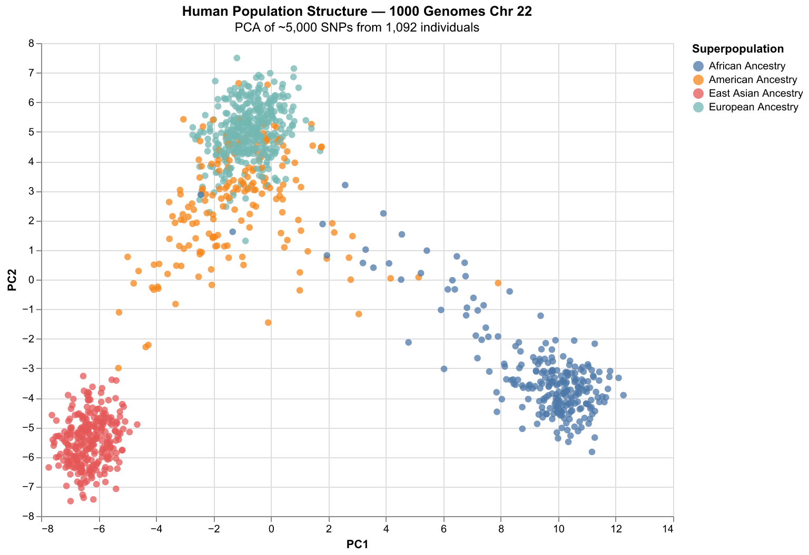
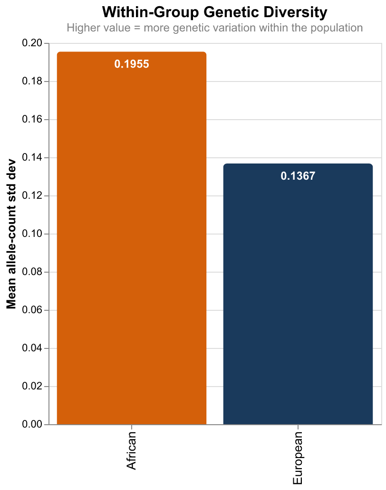
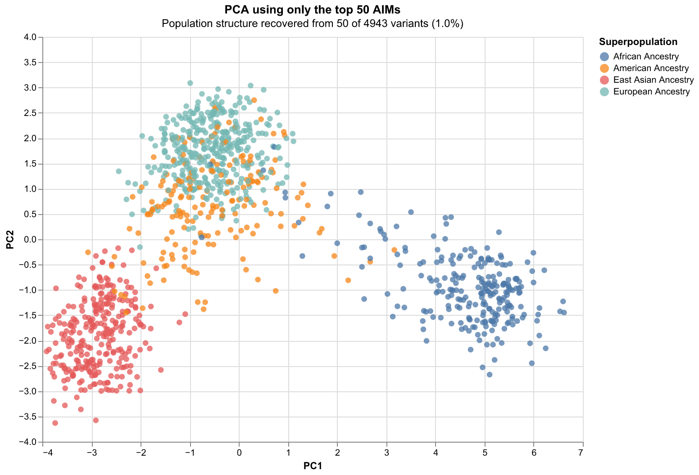

# Genes and Geography

> **Recovering global population structure and identifying ancestry-informative markers from 1000 Genomes chromosome 22 data — a Python pipeline replicating and extending Novembre et al. (2008).**

[](https://www.python.org/)
[](LICENSE)
[]()
[](https://genes-and-geography.streamlit.app)
---

## TL;DR

Using ~5,000 SNPs from chromosome 22 across 1,092 individuals, this project:

- **Recovers four continental population clusters** via PCA, with the African cluster ~43% more diverse than the European cluster — the genomic signature of the out-of-Africa bottleneck.
- **Identifies the specific variants encoding that structure** using Fst, finding that just **50 variants (1% of the data) reproduce the same clustering** as the full panel.
- **Connects the result to clinical medicine** — the same kind of high-Fst variants underlie why drug dosing algorithms calibrated in European populations fail in Nigerian patients.



---

## Why This Matters (For Non-Specialists)

Every human carries roughly 3 billion DNA letters. At ~10 million positions, people differ from each other — sometimes one person has a "T" where another has a "C". These differences are called **variants**, and most of them are biologically silent. But the pattern of variants you carry tells a story about where your ancestors came from, because populations that lived apart accumulated slightly different patterns over thousands of years.

This project takes DNA data from 1,092 people across Africa, Europe, East Asia, and the Americas, and asks a simple question: **if you map their genetic variation onto a 2D plot, does the plot look anything like a real-world map?**

The answer is yes. People cluster by geography on the plot — Yoruba (Nigeria) on one side, Han Chinese (Beijing) on another, British (England) in between. Nobody told the algorithm where anyone is from. It discovered geography from the DNA alone.

The project then goes further. It quantifies how much more genetic variety African populations carry compared to Europeans (43% more, on chromosome 22 alone). It identifies the specific variants that encode the population differences. And it connects all of this to a real clinical problem: **drugs are tested mostly in European patients, but the genes that control how drugs work in the body vary substantially between populations** — meaning a "standard dose" can be too high or too low for African patients depending on their genetic background.

In short: this is a project about reading human history from DNA, and about why precision medicine cannot be built on data from one part of the world.

---

## The Scientific Question

Does genetic similarity mirror geographic proximity in human populations? And if so:

1. How does that structure differ between Africa and Europe?
2. What does the difference tell us about human history?
3. Which specific variants encode the structure — and why does this matter clinically?

---

## Background

In 2008, Novembre et al. showed that compressing genetic variation in 1,387 Europeans into two dimensions with PCA recovers a recognisable map of Europe. The plot looked so much like a geographic map that the paper's title — *"Genes mirror geography within Europe"* — has become one of the most cited results in human population genetics.

This project reproduces that finding using publicly available 1000 Genomes Phase 1 data, then extends it in three directions:

- **Globally** — applying the same method across all four superpopulations
- **Within Africa** — examining structure among Yoruba (Nigeria), Luhya (Kenya), and African-American samples
- **Mechanistically** — identifying the specific variants doing the work of separating populations

All analysis runs end-to-end in Python on a laptop using openly available tools.

---

## Pipeline

| Step | What it does | Tool |
|------|--------------|------|
| 1 | Parse chr22 VCF, sub-sample every 100th variant | pysam |
| 2 | Build (1092 × 4943) genotype matrix, attach population labels | numpy, pandas |
| 3 | Global PCA & visualisation | scikit-learn, Altair |
| 4 | t-SNE comparison | scikit-learn |
| 5 | SNP-PCA (variants instead of individuals) | scikit-learn |
| 6 | Within-European PCA replicating Novembre 2008 | scikit-learn |
| 7 | Within-Africa PCA (YRI / LWK / ASW) with PC1–PC3 analysis | scikit-learn |
| 8 | Out-of-Africa diversity quantification | numpy |
| 9 | Ancestry-informative marker (AIM) identification via Fst | numpy (vectorised) |
| 10 | Top-50 AIMs PCA — validating structure recovery from 1% of variants | scikit-learn |

---

## Key Results

### 1. Global population structure recovers cleanly


Four continental clusters separate clearly along PC1 and PC2 with **just chromosome 22**: African Ancestry (right), European Ancestry (top centre), East Asian Ancestry (bottom left), and American Ancestry (centre, smearing between groups due to admixture).

PC1 explains **8.25%** of total variance, PC2 **5.41%**. These look small but are biologically substantial — out of thousands of independent variants, two axes capture enough population-structured signal to separate continents.

The African cluster is visibly more spread out than the others. That is not a plotting artefact — it is the within-population diversity difference made visible.

### 2. Within-Africa structure encodes geography

Open the [interactive HTML](results/figures/pca_africa_pc1v2.html) for hover details.

- **YRI (Nigeria) vs LWK (Kenya)** separate along PC2 — a real West-vs-East Africa divide written in DNA across ~6,000 km of continent.
- **ASW (African-American)** samples smear far to the left of continental Africans on PC1, reflecting documented European admixture from the transatlantic slave trade.

A PC1–PC2–PC3 analysis confirms that within-Africa structure is fully captured in the first two components; PC3 carries no additional population signal beyond PC1 and PC2.

### 3. African populations are ~43% more genetically diverse



| Population | Mean within-group allele-count std dev | n |
|------------|----------------------------------------|---|
| European | **0.1367** | 379 |
| African | **0.1955** | 246 |
| **Ratio (AFR / EUR)** | **1.430×** | — |

African populations carry **43% more within-group genetic variability** on chromosome 22 than Europeans. This is the quantitative fingerprint of the out-of-Africa bottleneck approximately 70,000 years ago: every non-African today descends from a small founding group that carried only a subset of African genetic diversity.

### 4. Ancestry-informative markers — 1% of variants do the work

The Fst distribution across ~5,000 chr22 variants is heavily skewed toward zero, confirming Lewontin's classic finding that most human variation is within populations, not between them:

- **Mean Fst:** 0.0334
- **Median Fst:** 0.0152
- **Max Fst:** 0.4751
- **Variants with Fst > 0.3:** 20
- **Variants with Fst > 0.1:** 392

See the [interactive Fst distribution](results/figures/fst_distribution.html).

Two methods of AIM identification — SNP-PCA distance from origin and direct Fst calculation — agree weakly (Pearson r = **0.344**). SNP-PCA captures variants that behave unusually for any reason (including linkage disequilibrium); Fst specifically measures between-population differentiation. Fst was therefore used as the primary criterion for AIM selection.

The headline result: **PCA on the top 50 highest-Fst variants recovers the same four-cluster global structure as the full ~5,000-variant panel.**



With only 1% of the variants:
- **PC1 explains 36.04%** (vs 8.25% in the full panel)
- **PC2 explains 12.57%** (vs 5.41%)
- **Combined: 48.61%** of variance captured in 2 dimensions

The clusters are tighter and the variance explained jumps dramatically — because removing 4,893 uninformative variants concentrates the population-structure signal that was previously diluted by within-population noise. This is the principle behind commercial ancestry inference panels: 23andMe doesn't sequence whole genomes, it reads a few hundred carefully chosen markers exactly like these.

---

## Interpretation

**Population structure is real, but humanity is overwhelmingly genetically similar.** The Fst distribution confirms Lewontin's 1972 partition: the overwhelming majority of human genetic variation sits within populations, not between them. The clusters visible in PCA are produced by a small minority of variants — the AIMs identified here. There are no categorical genetic boundaries between populations; there are statistical tendencies in a small subset of the genome.

**The out-of-Africa bottleneck remains visible 70,000 years later.** African populations carry more diversity than non-African populations because the founding migrant group was small and carried only a subset of African variation. The within-Africa PCA recovers real geographic structure — Yoruba vs Luhya separation along PC2 corresponds to the West-vs-East Africa divide. ASW samples sit between continental African and European positions, the genomic record of the transatlantic slave trade.

**Most disease-associated variants transfer across ancestries; the ones that matter most for drug metabolism do not.** Drug-metabolising enzymes — CYP2D6, CYP3A5, CYP2C19 — carry variants with Fst substantially higher than the genome average. They are precisely the type of variants this analysis identifies as ancestry-informative. A dosing algorithm validated only in European data cannot be assumed to work in Nigerian patients, because the variants driving drug response in West Africans are systematically different in frequency from those in Europeans. The diversity ratio (1.43×) shows the gap quantitatively. The AIMs analysis identifies the specific variants creating it. This is why ancestry-blind genomic medicine fails — and why locally-relevant genomic data from African populations is a clinical priority, not a diversity nicety.

---

## Limitations

A careful reading requires understanding what this analysis can and cannot conclude:

- **Single chromosome.** Uses ~5,000 sub-sampled variants from chromosome 22 only, versus 197,146 SNPs across all autosomes in Novembre et al. (2008). Continental structure recovers clearly, but fine-scale within-Europe geography only partially emerges — Finnish samples show weak separation along PC1 but the full geographic map of Europe does not appear.

- **Sub-sampling may have missed high-Fst variants.** Taking every 100th variant gives a representative cross-section but is non-informative — some of the strongest AIMs may have been excluded by chance. A two-pass approach (compute Fst on all variants, then sub-sample informatively) would identify a more complete AIM set.

- **Phase 1 African populations are limited** to YRI, LWK, and ASW. Phase 3 (26 populations) or the Tishkoff et al. African genomics datasets would provide far richer within-Africa resolution. Three populations cannot capture the full diversity of a continent that hosted modern humans for 300,000 years.

- **ASW samples are admixed** and should not be interpreted as representing continental African genetic diversity directly. Their position in the within-Africa PCA reflects substantial European ancestry from documented post-1500 admixture.

- **Missing genotypes treated as homozygous reference** in the allele-count collapse step. This biases populations with more missing data (typically those sequenced at lower depth) toward the reference genome, which was built primarily from European individuals. The bias is small in Phase 1 data but means African diversity may be slightly underestimated.

- **No formal quality control filtering.** A production pipeline would filter by minor allele frequency, Hardy-Weinberg equilibrium, and per-variant missingness before analysis. This was omitted to keep the pipeline tutorial-tractable.

- **Fst calculated via the simplified weighted-variance form**, not the unbiased Weir & Cockerham (1984) estimator. Adequate for descriptive analysis; rigorous estimation should use the latter.

- **Pearson correlation between AIM methods is weak (r = 0.344).** This is presented as a finding rather than a problem — the methods measure partially different things — but means that conclusions drawn from either method alone should be treated cautiously without cross-validation.

- **No external validation.** The top AIMs identified here have not been compared against published ancestry-inference panels (e.g. HapMap, 23andMe). A natural next step would be to cross-reference against existing AIM databases.

---

## How to Reproduce

```bash
git clone https://github.com/DrTim105/genes-and-geography.git
cd genes-and-geography
mamba env create -f environment.yml
conda activate geogenes

# Download data following data/README.md (1000 Genomes Phase 1 chr22 VCF + panel files)

python scripts/01_parse_vcf.py        # builds data/processed/matrix.csv
jupyter notebook notebooks/02_visualise.ipynb

# Or run the interactive explorer
streamlit run streamlit_app/app.py
```

---

## Repository Structure
```
genes-and-geography/
├── README.md                          # This file
├── environment.yml                    # Conda environment specification
├── .gitignore                         # Excludes data/raw from git
├── data/
│   ├── README.md                      # Data download instructions
│   ├── raw/                           # 1000 Genomes data (gitignored)
│   └── processed/                     # matrix.csv (gitignored)
├── scripts/
│   └── 01_parse_vcf.py                # VCF → genotype matrix
├── notebooks/
│   └── 02_visualise.ipynb             # All analysis and figures
└── results/
|   └── figures/                       # PCA, t-SNE, AIMs figures
├── streamlit_app/
│   ├── app.py                         # Interactive Streamlit explorer
│   ├── styles.py                      # Custom dark theme CSS
│   ├── components.py                  # Reusable HTML components
│   ├── requirements.txt               # Streamlit Cloud dependencies
│   └── data/                          # Precomputed PCA coordinates and stats
```
 
---
---

## References

1. Novembre J, Johnson T, Bryc K, et al. **Genes mirror geography within Europe.** *Nature* 456:98–101 (2008). [doi:10.1038/nature07331](https://doi.org/10.1038/nature07331)
2. 1000 Genomes Project Consortium. **An integrated map of genetic variation from 1,092 human genomes.** *Nature* 491:56–65 (2012). [doi:10.1038/nature11632](https://doi.org/10.1038/nature11632)
3. Lewontin RC. **The apportionment of human diversity.** *Evolutionary Biology* 6:381–398 (1972).
4. Tishkoff SA, Reed FA, Friedlaender FR, et al. **The genetic structure and history of Africans and African Americans.** *Science* 324:1035 (2009). [doi:10.1126/science.1172257](https://doi.org/10.1126/science.1172257)
5. Martin AR, Kanai M, Kamatani Y, et al. **Clinical use of current polygenic risk scores may exacerbate health disparities.** *Nature Genetics* 51:584 (2019). [doi:10.1038/s41588-019-0379-x](https://doi.org/10.1038/s41588-019-0379-x)
6. Weir BS, Cockerham CC. **Estimating F-statistics for the analysis of population structure.** *Evolution* 38:1358–1370 (1984).

---

## Acknowledgements

Built as part of a self-directed bioinformatics learning track. Inspired by OMGenomic's open educational materials.

---

## Author

**Dr. Salihu Timothy** (M.B.Ch.B, Obafemi Awolowo University)
Aspiring bioinformatician with a clinical pharmacology angle on population genomics and precision medicine.

[GitHub: @DrTim105](https://github.com/DrTim105)